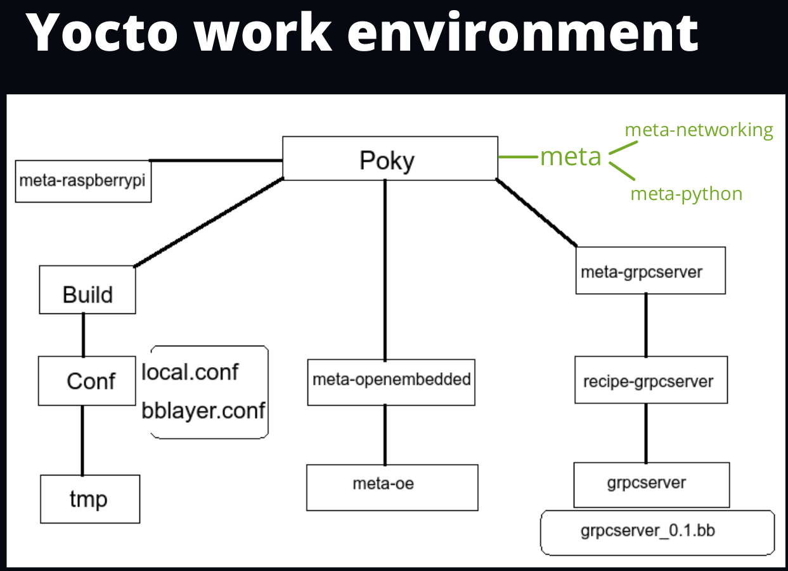
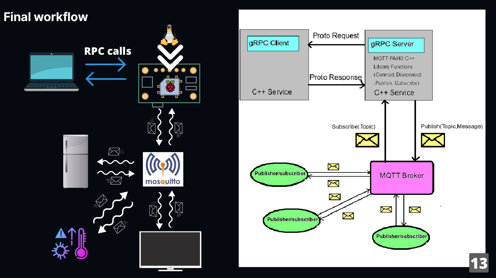

# Linux.Qemu-Raspberrypi.distro.gRPC.Server.MQTT.Paho.CPP.Yocto.Custom.App

The main target of this work is to create a gRPC server application based on Paho library in a custom build linux distribution, using the YOCTO Project/ Poky reference.
the C++ gRPC server scripts Github link: https://github.com/Hernado998/gRPC.Server.MQTT.PAHO.CPP

# QEMU:

**1- Install required packages The following packages are  in Ubuntu:**
```css
	sudo apt-get install gawk wget git-core diffstat unzip texinfo gcc-multilib \
	build-essential chrpath socat libsdl1.2-dev xterm
```
		
**2- Building Poky and using QEMU First we need to get the reference distribution (Poky).**
```css
	git clone --branch hardknott git://git.yoctoproject.org/poky
	cd pokyd
```
		
**3- Clone the openembedded layer:**
```css
	git clone --branch hardknott https://github.com/openembedded/meta-openembedded
```
		
**4- Clone the custom grpc server layer:**
```css
	git clone https://github.com/Hernado998/Linux.Qemu-Raspberrypi.distro.gRPC.Server.MQTT.Paho.CPP.Yocto.Custom.App
```
		
**5- Go to files folder in the meta-grpserver recipe**
```css
	cd ~/yocto/poky/meta-grpcserver/recipes-grpcserver/grpcserver/files
```
	
**6- go back to ~/yocto/poky and initialize the build environment.**
```css	
	source oe-init-build-env qemubuild
```
		
**7- Now as a final step we need to add our new layer meta-grpcserver & meta-openembedded to our configuration file ~/yocto/poky/qemubuild/conf/bblayers.conf.**
```css
	bitbake-layers add-layer ~/yocto/poky/meta-grpcserver/
	bitbake-layers add-layer ~/yocto/poky/meta-openembedded/meta-oe/
	bitbake-layers add-layer ~/yocto/poky/meta-openembedded/meta-python/
	bitbake-layers add-layer ~/yocto/poky/meta-openembedded/meta-networking/
```
		 
**8- check if the layers are correctly added, go to ~/yocto/poky/qemubuild/conf/bblayers.conf or type this command:**
```css
	bitbake-layers show-layers
```
***You will see something like this:***


				layer                 path                                      
	=================================================================
	meta                  ~/poky/meta               
	meta-yocto            ~/poky/meta-yocto         
	meta-yocto-bsp        ~/poky/meta-yocto-bsp     
	meta-grpcserver       ~/poky/meta-grpcserver    
	meta-oe               ~/poky/meta-openembedded/meta-oe
	meta-python	      ~/poky/meta-openembedded/meta-python \
        meta-networking       ~/poky/meta-openembedded/meta-networking \
	


**9- Open yocto/poky/qemubuild/conf/local.conf and add these lignes:**
```css
	DISTRO_FEATURES_append = " systemd"
	DISTRO_FEATURES_BACKFILL_CONSIDERED += "sysvinit"
	VIRTUAL-RUNTIME_init_manager = "systemd"
	VIRTUAL-RUNTIME_initscripts = "systemd-compat-units"
```

**10- change Machine value in the local.conf file to MACHINE ??= "qemux86-64"**
	
**11- Now we can build our custom image by running: (this can take several hours, for me it took 3~4 hours depending on the building machine) ... go to ~/yocto/poky/meta-grpcserver/recipes-core/images and rename rpi-server-image.bb to rpi-server-image (this step disable the rpi bitbake) **
```css
	bitbake qemu-server-image
```
		
**12- When the build has completed we can run it with QEMU as before.**
```css
	runqemu qemux86-64
```

# To bake a raspberrypi4 (64bit) distro add/modify the following steps :

**3-** git clone git clone --branch hardknott git://git.yoctoproject.org/meta-raspberrypi

**7-** source oe-init-build-env rpibuild

**8-** bitbake-layers add-layer ~/yocto/poky/meta-raspberrypi /

**9prime- To add wifi, bluetooth and dhcp components add these lignes:**
```css
        DISTRO_FEATURES_append = " bluez5 bluetooth wifi"
	IMAGE_INSTALL_append = " linux-firmware-bcm43430 bluez5 i2c-tools python3-smbus bridge-utils hostapd  iptables wpa-supplicant dhcpcd"
```
**11-** MACHINE ??= "raspberrypi4-64" & rename rpi-server-image to rpi-server-image.bb

**To connect to WiFi, We will need to change the wpa-supplicant.conf file as below, by modifying poky/meta/recipes-connectivity/wpa-supplicant/wpa-supplicant/wpa_supplicant.conf-sane**
```css
ctrl_interface=/var/run/wpa_supplicant
ctrl_interface_group=0
update_config=1

network={
        ssid="MYSSID"
        psk="MY-SECURE-PASSKEY"
        proto=RSN
        key_mgmt=WPA-PSK
}
```
**12-** bitbake rpi-server-image

**To write the rpi image to an sd card follow these steps :**
```css
	cd ~/yocto/poky/rpibuild/tmp/deploy/images/raspberrypi4-64
```
```css
	sudo bmaptool copy rpi-server-image-raspberrypi4-64.wic.bz2 /dev/sdb
```
In the above command you may experience some error related to the disk .. open Disks go to your sd card format it.

**After the above steps you will be able to connect to wifi using this command:**
```css
wpa_supplicant -Dnl80211 -iwlan0 -c/etc/wpa_supplicant.conf"
```
**To connect your Raspberry Pi4 to wifi on boot follow these steps:**
https://www.howtogeek.com/687970/how-to-run-a-linux-program-at-startup-with-systemd/




